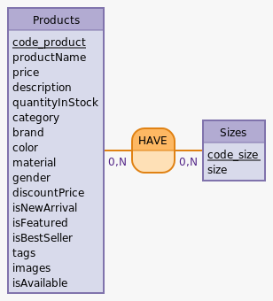

# Conception de la base de données

Les tables "products" et "sizes", établissent une relation de type "many-to-many". Cette relation permet à plusieurs produits de partager plusieurs tailles, et vice versa. Dans le schéma de base de données, chaque entrée dans la table "products" est associée à une ou plusieurs entrées dans la table "sizes" grâce à des clés étrangères. De même, chaque entrée dans la table "sizes" peut être liée à plusieurs produits. Cette conception offre une grande flexibilité pour gérer des produits de différentes dimensions et variations, en permettant aux produits de s'adapter à différentes tailles et aux tailles de s'appliquer à différents produits. Pour mettre en œuvre cette relation many-to-many, une table de jonction intermédiaire peut être utilisée pour maintenir les correspondances entre les produits et les tailles, en enregistrant les identifiants uniques des produits et des tailles concernées.