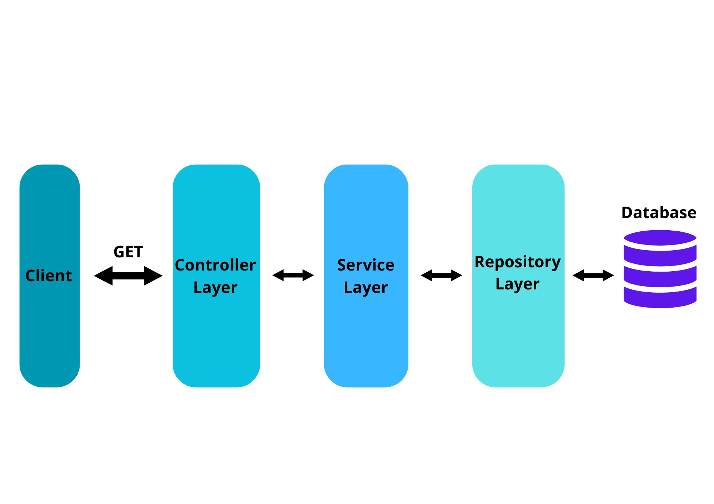

# L'architecture back-end

## Controller - Service - Repository 

La décision de structurer l'application en utilisant l'architecture en couches de Spring Boot, composée des couches Controller, Service et Repository, a été prise dans le but de créer une application robuste, modulaire et hautement maintenable. Chaque couche a un rôle distinct qui contribue à la clarté, à la séparation des responsabilités et à la facilité de développement.

La couche Controller agit comme la façade de l'application, gérant les requêtes HTTP et les interactions avec les clients. En adoptant cette couche, nous pouvons centraliser la logique de gestion des points d'extrémité API, tout en isolant les détails de mise en forme et de communication avec les clients. Cela favorise la flexibilité, permettant aux clients d'interagir avec l'application via des requêtes RESTful bien définies.

La couche Service, quant à elle, se concentre sur la logique métier de l'application. En séparant cette logique de traitement des données des contrôleurs, nous favorisons la réutilisabilité et la maintenabilité. Les services encapsulent les opérations complexes et les règles métier, et peuvent être facilement testés de manière isolée. En outre, cette séparation permet une meilleure gestion des transactions et de la sécurité.

Enfin, la couche Repository gère l'accès aux données et la communication avec la source de données, qu'il s'agisse d'une base de données, d'un service externe ou d'une autre source. En utilisant des interfaces de repository, nous pouvons définir des méthodes pour effectuer des opérations de lecture/écriture de données, facilitant ainsi la création, la récupération et la manipulation des données sans compromettre l'abstraction de la source de données sous-jacente.

En adoptant cette organisation en couches, nous avons pu séparer efficacement les préoccupations, améliorer la réutilisabilité du code, simplifier la maintenance et permettre un développement parallèle plus fluide. L'architecture en couches de Spring Boot favorise une conception élégante et évolutive de l'application, contribuant ainsi à la création d'un code propre, bien structuré et plus facilement extensible.

